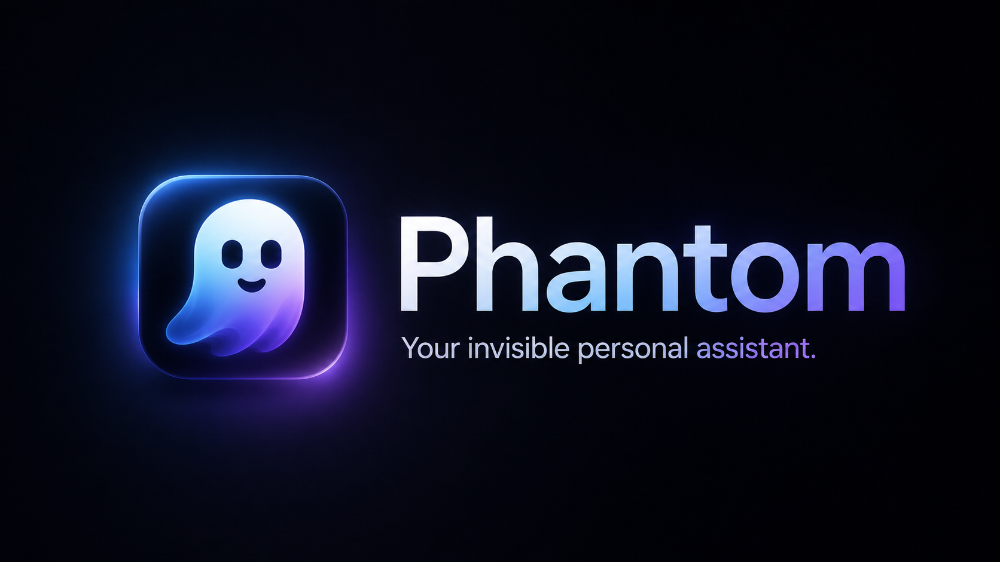

<div align="center">

# 👻 Phantom

**The open-source Cluely alternative for Windows.**
A stealth AI overlay that gives you real-time answers during meetings, interviews, and coding sessions — without switching windows or paying a subscription.

[](LICENSE)
[](https://github.com)
[](https://electronjs.org)
[](https://react.dev)
[](README.md)
[](README.md)

---



---

*Float. Ask. Respond. Disappear.*

</div>

---

## What is Phantom?

Phantom is a **transparent AI assistant overlay** that floats invisibly on top of every window on your screen. It is a free, open-source alternative to Cluely — built for anyone who wants real-time AI help during live situations without paying $20–$40/month.

**Use it for:**
- **Job interviews** — get instant answers to technical questions while screen-sharing
- **Online meetings** — ask AI about anything being discussed without switching tabs
- **Coding sessions** — paste errors, get fixes, never leave your editor
- **Research & writing** — screenshot any content and ask questions about it instantly
- **Any task** — it lives above every app, always a shortcut away

**How it works:** Press `Ctrl+\` to show the bar. Type your question (or attach a screenshot). Get a streaming AI response in a floating window below. Press `Ctrl+\` again to hide everything. Nobody sees it.

- Floats **invisibly above every application** — protected from screenshots and screen recordings
- Connects to **any AI provider** — OpenAI, Claude, Gemini, Grok, Mistral, and more
- **No subscription, no cloud account, no telemetry** — your key, your data, your machine
- Transcribes **microphone and system audio** in real time
- Attaches **screenshots and files** to any message

---

## Features at a Glance

| Feature | Details |
|---------|---------|
| **Transparent Overlay** | Frameless, always-on-top window. Toggle with `Ctrl+\` |
| **10 Built-in AI Providers** | OpenAI, Claude, Gemini, Grok, Mistral, Cohere, Groq, Perplexity, OpenRouter, Ollama |
| **Custom Providers** | Add any OpenAI-compatible endpoint via a curl template |
| **Speech-to-Text** | 9 built-in STT providers + custom curl templates |
| **Screenshot Capture** | Full-screen or drag-select a region, auto-attached to your next message |
| **System Audio Loopback** | Transcribe audio playing on your PC (Windows) |
| **File Attachments** | Attach up to 6 files per message |
| **Conversation History** | SQLite-backed local storage, searchable from the dashboard |
| **Custom System Prompts** | Save and switch personas/contexts on the fly |
| **Secure Key Storage** | API keys encrypted via Electron `safeStorage` |
| **Streaming Responses** | Real-time token streaming for all built-in providers |
| **Keyboard-Driven** | Every action has a configurable shortcut |
| **No Paywall** | GPL-3.0 open source. Forever free. |

---

## Phantom vs Cluely

Cluely (and tools like it) are paid, closed-source screen AI assistants. Phantom gives you the same core capability — a stealth overlay that answers questions in real time — with zero cost and full control over your data.

| | Phantom | Cluely |
|---|---|---|
| **Price** | Free forever | $20–$40/month |
| **Open source** | ✅ GPL-3.0 | ❌ Closed |
| **AI provider** | Any (your own key) | Locked to their API |
| **Data privacy** | 100% local | Sent to their servers |
| **Telemetry** | None | Yes |
| **Custom providers** | ✅ Any curl-compatible API | ❌ |
| **System audio** | ✅ Windows loopback | ✅ |
| **Screenshot analysis** | ✅ Full & region capture | ✅ |
| **Platform** | Windows (Mac WIP) | Mac + Windows |
| **Screen recording protection** | ✅ | ✅ |

> Phantom won't auto-generate interview answers or do real-time meeting summaries out of the box — those are prompting strategies you configure with your own system prompts. What Phantom does is put any AI model one keystroke away, invisible, above every window.

---

## Quick Start

### Prerequisites

- **Windows 10/11** (64-bit)
- **Node.js 20+** — [nodejs.org](https://nodejs.org)
- **npm** (comes with Node)
- An API key from at least one AI provider (or a local Ollama install)

### Install & Run

```powershell
# Clone the repo
git clone https://github.com/debajyoti2050/phantom.git
cd phantom

# Install dependencies
npm install

# Start in development mode
npm run dev
```

The Vite dev server starts on the first free local port from `1420`, `1421`, `1422`, or `1423`, and Electron launches automatically against that URL.

### Build a Distributable

```powershell
# Type-check first
npm run typecheck

# Build the renderer bundle
npm run build

# Package Windows installer + portable executable
npm run dist:win

# Package macOS DMG + ZIP on macOS
npm run dist:mac
```

macOS builds are unsigned by default because Phantom is personal local software. GitHub Actions does not require Apple signing secrets for normal personal releases.

If you later want a Gatekeeper-safe macOS release that opens normally after browser download on any Mac, add these optional GitHub repository secrets:

```text
CSC_LINK
CSC_KEY_PASSWORD
APPLE_API_KEY
APPLE_API_KEY_ID
APPLE_API_ISSUER
```

`CSC_LINK` is your exported Developer ID Application certificate as a base64-encoded `.p12`. The Apple API key values come from App Store Connect. Without these optional secrets, the macOS artifact stays unsigned. If macOS blocks a browser-downloaded unsigned app, remove quarantine once:

```bash
xattr -dr com.apple.quarantine /Applications/Phantom.app
```

Output lands in `release/`. Windows builds produce an NSIS installer and a portable `.exe`; macOS builds produce `.dmg` and `.zip` artifacts.

---

## Setting Up Your First AI Provider

When Phantom opens for the first time, open the **Dashboard** (`Ctrl+Shift+D`) and go to **Providers**.

### Option A — Built-in Providers (Recommended)

Choose from 10 pre-configured providers. All you need is an API key.

| Provider | Where to get a key |
|----------|--------------------|
| **OpenAI** | [platform.openai.com/api-keys](https://platform.openai.com/api-keys) |
| **Claude (Anthropic)** | [console.anthropic.com](https://console.anthropic.com) |
| **Gemini (Google)** | [aistudio.google.com/app/apikey](https://aistudio.google.com/app/apikey) |
| **Grok (xAI)** | [console.x.ai](https://console.x.ai) |
| **Mistral** | [console.mistral.ai](https://console.mistral.ai) |
| **Cohere** | [dashboard.cohere.com](https://dashboard.cohere.com) |
| **Groq** | [console.groq.com](https://console.groq.com) |
| **Perplexity** | [perplexity.ai/settings/api](https://perplexity.ai/settings/api) |
| **OpenRouter** | [openrouter.ai/keys](https://openrouter.ai/keys) |
| **Ollama** | No key needed — [ollama.com](https://ollama.com) (runs locally) |

**Steps:**
1. Open Dashboard → **Providers** tab
2. Click a provider card
3. Paste your API key
4. Pick a model from the dropdown
5. Click **Save** — you're ready

---

### Option B — Custom Provider (Advanced)

Phantom uses **curl templates** to support any HTTP-based AI API. This means if a service has a REST API, you can connect it.

#### How Custom Providers Work

A custom provider is a curl command with placeholder variables that Phantom fills in at request time:

| Variable | Replaced with |
|----------|--------------|
| `{{API_KEY}}` | Your stored API key (encrypted) |
| `{{MODEL}}` | The selected model name |
| `{{SYSTEM_PROMPT}}` | Your active system prompt |
| `{{TEXT}}` | The user's message text |
| `{{IMAGE}}` | Base64-encoded image (if screenshot/image attached) |

#### Example: OpenAI-compatible endpoint

```bash
curl https://api.openai.com/v1/chat/completions \
  -H "Authorization: Bearer {{API_KEY}}" \
  -H "Content-Type: application/json" \
  -d '{
    "model": "{{MODEL}}",
    "stream": true,
    "messages": [
      {"role": "system", "content": "{{SYSTEM_PROMPT}}"},
      {"role": "user", "content": "{{TEXT}}"}
    ]
  }'
```

#### Example: Custom endpoint with image support

```bash
curl https://my-api.example.com/v1/chat/completions \
  -H "Authorization: Bearer {{API_KEY}}" \
  -H "Content-Type: application/json" \
  -d '{
    "model": "{{MODEL}}",
    "stream": true,
    "messages": [
      {
        "role": "user",
        "content": [
          {"type": "text", "text": "{{TEXT}}"},
          {"type": "image_url", "image_url": {"url": "data:image/png;base64,{{IMAGE}}"}}
        ]
      }
    ]
  }'
```

#### Adding a Custom Provider

1. Dashboard → **Providers** → **Add Custom**
2. Paste your curl command with `{{variables}}`
3. Set **Response Content Path** — a dot-notation path to extract the text from the JSON response:
   - OpenAI format: `choices[0].message.content`
   - Anthropic format: `content[0].text`
   - Custom: inspect your API's response shape and trace the path to the text field
4. Toggle **Streaming** if your endpoint supports `text/event-stream`
5. Enter your API key — it gets encrypted on save
6. Click **Save**

> **Tip:** Click "Copy from built-in" to start from a working template and modify it.

---

## Speech-to-Text Setup

Phantom supports both **microphone input** and **Windows system audio loopback** (transcribing audio playing on your PC).

### Built-in STT Providers

| Provider | Notes |
|----------|-------|
| OpenAI Whisper | Fast, accurate, multilingual |
| Groq Whisper | Fastest option |
| ElevenLabs | High quality |
| Google Speech | Broad language support |
| Deepgram | Low latency |
| Azure Speech | Enterprise-grade |
| Speechmatics | Accuracy-focused |
| Rev.ai | Async + real-time |
| IBM Watson | On-prem option |

### Custom STT Provider

Same curl-template approach as AI providers. Your template receives:
- `{{API_KEY}}` — your key
- The audio file is sent as multipart form data

Configure in Dashboard → **Audio** tab.

### System Audio Capture (Windows)

Phantom can transcribe audio coming **out** of your speakers — useful for meetings, videos, or any live audio.

1. Dashboard → **Audio** → enable **System Audio**
2. On first use, a setup wizard installs the virtual audio device driver
3. Use the audio visualizer in the overlay bar to confirm capture is active
4. Phantom transcribes in real time and streams the transcript into the response window

---

## Keyboard Shortcuts

All shortcuts are **global** — they work even when Phantom's window isn't focused.

| Shortcut | Action |
|----------|--------|
| `Ctrl + \` | Toggle overlay visibility |
| `Ctrl + Shift + I` | Focus the command input |
| `Ctrl + Shift + D` | Open / close the dashboard |
| `Ctrl + ↑ / ↓ / ← / →` | Move the overlay window |
| `Enter` | Send message |
| `Shift + Enter` | Insert newline |
| `Ctrl + K` | Toggle keep-engaged mode (keep response open) |

### Customizing Shortcuts

Dashboard → **Shortcuts** → click any action → press your new key combination → Save.

---

## Dashboard Overview

The dashboard (`Ctrl+Shift+D`) is your control center:

| Section | What you can do |
|---------|----------------|
| **Chats** | Browse and search conversation history |
| **Providers** | Add / edit / remove AI providers and API keys |
| **Audio** | Configure STT provider, audio device, system audio |
| **System Prompts** | Create and manage saved personas / instructions |
| **Shortcuts** | Remap any global shortcut |
| **Settings** | Theme, always-on-top, auto-start, clear history |
| **Responses** | Review past AI responses with syntax-highlighted code |

---

## Using Screenshots

1. Click the **camera icon** in the overlay bar
2. Choose **Full screen** or drag to **select a region**
3. The capture is automatically attached to your next message
4. Type your question and press `Enter` — the image travels with your prompt

Phantom encodes the screenshot as base64 and includes it in the API request, so models with vision support (GPT-4o, Claude 3, Gemini 1.5, etc.) can analyze it directly.

---

## File Attachments

Click the **paperclip icon** in the overlay bar to attach files. Up to **6 files** per message. Supported formats depend on the model — most vision-capable models accept images; code models accept text files.

---

## Architecture (For Developers)

```
phantom/
├── electron/
│   └── main.cjs          # Main process: windows, IPC, HTTP proxy, shortcuts
├── src/
│   ├── pages/
│   │   ├── app/          # Overlay UI (command bar)
│   │   ├── dashboard/    # Settings hub
│   │   ├── dev/          # Provider config pages
│   │   ├── responses/    # Response viewer
│   │   ├── chats/        # Conversation history
│   │   └── ...
│   ├── hooks/            # React hooks (completion, audio, shortcuts, etc.)
│   ├── config/           # Provider + STT constants and curl templates
│   ├── components/       # Shared UI components
│   └── global.css        # All phantom-* theme classes + Tailwind
└── package.json
```

### Key Design Decisions

**Main-process HTTP proxy** — All API requests go through `ipcMain` in the Electron main process. This bypasses browser CORS restrictions entirely — no proxy server needed, no `--disable-web-security`.

**Transparent frameless window** — The overlay is a `transparent: true`, `frame: false` Electron window that floats above all other apps. CSS `background: transparent` on `body` makes only your UI elements visible.

**SQLite via sql.js** — Full SQL database in WASM. No native Node bindings to compile. Conversations, messages, and system prompts persist locally with no external dependency.

**Secure key storage** — API keys are encrypted with `electron.safeStorage` before writing to disk. On Windows this uses DPAPI (tied to your user account).

**Separate response window** — The AI response renders in a second Electron `BrowserWindow` that appears below the command bar. This sidesteps Electron's limitation where transparent windows on Windows cannot be programmatically resized after creation.

**Streaming** — Responses stream token-by-token via `EventSource`-style chunked HTTP in the main process, forwarded to the renderer via IPC events.

---

## Privacy & Security

- **No telemetry** — zero analytics, no crash reports, no usage data sent anywhere
- **No hosted services** — 100% of network traffic goes directly from your machine to your chosen AI provider
- **API keys encrypted at rest** — stored with `electron.safeStorage` (Windows DPAPI)
- **Content protection** — overlay and response windows have `setContentProtection(true)` — they won't appear in screenshots or screen recordings taken by other apps
- **Local database** — conversation history lives in your app data folder, never leaves your machine

---

## Contributing

Phantom is GPL-3.0 open source. PRs, bug reports, and feature requests welcome.

```powershell
# Run in dev mode
npm run dev

# Type-check
npm run typecheck

# Build production bundle (renderer only)
npm run build
```

---

## Repository

[github.com/debajyoti2050/phantom](https://github.com/debajyoti2050/phantom)

## License

GPL-3.0. See [`LICENSE`](LICENSE) and [`NOTICE.md`](NOTICE.md).

---

<div align="center">

Made for people who think faster than they can switch windows.

---

**Keywords:** Cluely alternative · open source Cluely · AI overlay Windows · invisible AI assistant · meeting AI assistant · interview AI assistant · real-time AI help · screen overlay AI · stealth AI · AI assistant that stays on screen · free Cluely alternative · AI during interviews · AI for meetings · coding AI overlay

</div>
